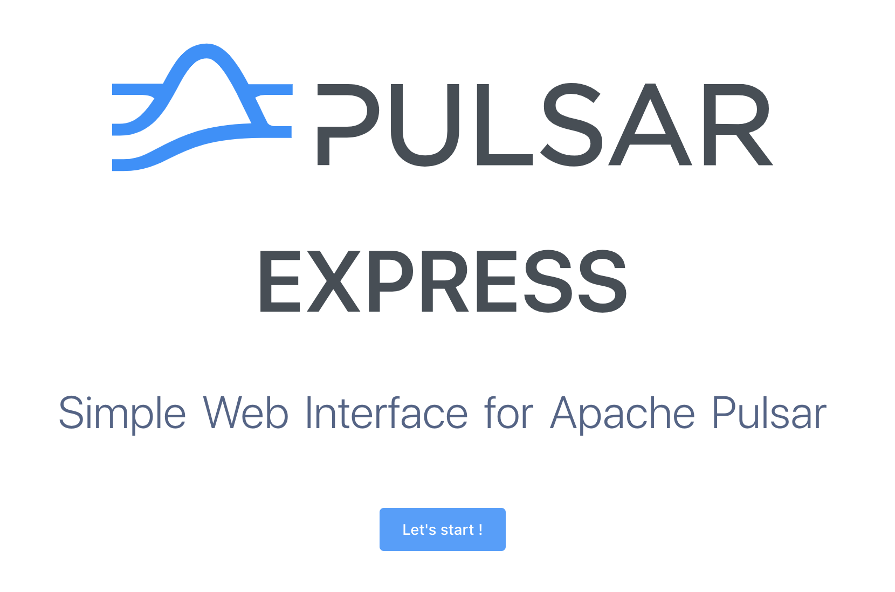
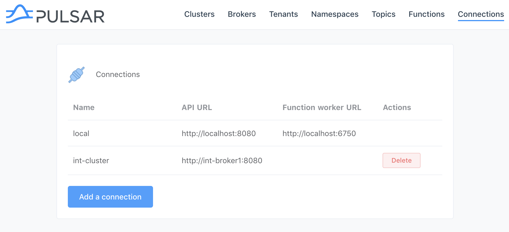
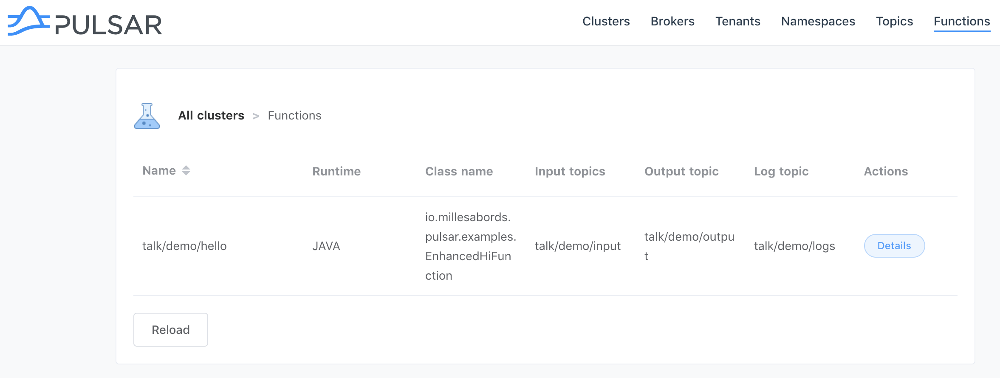

[](https://github.com/bbonnin/pulsar-express/blob/master/LICENSE)
[](https://github.com/bbonnin/pulsar-express/releases)


# pulsar-express

> Simple Web Interface for Apache Pulsar


## Install

There are several ways to use `pulsar-express`:
* By cloning the projet and running it locally (see `Development` section)
* By running a docker image: `docker run -it -p 3000:3000 bbonnin/pulsar-express`
  * You can set a connection url in the command: `docker run -it -p 3000:3000 -e PE_CONNECTION_URL=http://host.docker.internal:8080 bbonnin/pulsar-express`
  * Important: the calls to the Pulsar API are done on server side (i.e. from the container), so your Pulsar must be reachable from the container (do not use localhost :)). A solution: you can add `--network=host` to the command line (but, it's only working on Linux...)
* By installing it using `npm`
```bash
# Install it globally
$ npm install pulsar-express -g

# Start it
$ pulsar-express

        ╭────────────────╮
        │ PULSAR EXPRESS │
        ╰────────────────╯

        => Open http://localhost:3000


# Start it on a specific port
$ PORT=8000 pulsar-express

        ╭────────────────╮
        │ PULSAR EXPRESS │
        ╰────────────────╯

        => Open http://localhost:8000

```

If you want to configure connections (to be available to all users), you can:
* Create a json file with the connections:
```json
[
  { "name": "test cluster", 
     "url": "http://test-cluster-host:8080" },
  
  { "name": "integration cluster", 
     "url": "http://int-cluster-host:8080", 
     "token": "<YOUR_TOKEN>" },
  
  { "name": "prod cluster", 
     "url": "http://prod-cluster-host:8080", 
     "fctWorkerUrl": "http://prod-fct-worker-cluster-host:6750",
     "token": "<YOUR_TOKEN>" },
]
```
* and set the env variable `PE_CONFIG_FILE`
```bash
export PE_CONFIG_FILE=/path/to/my/config.json
```
* Or you can also set a connection URL
```bash
export PE_CONNECTION_URL=http://pulsar-host:8080

# Without a name, the url will be used (hostname:port),
# Or you can set a name:
export PE_CONNECTION_NAME=my-pulsar

# A token if needed:
export PE_CONNECTION_TOKEN=<YOUR_TOKEN>
```

From there, you can connect with your browser to the url above !




## Quick start

> If you haven't defined a connection, the first step is to go the `Connections` page and add a new connection. These connections are stored on client side (localstorage of your browser)



### Overview

In this page, you can see some basic informations about your clusters.


### Clusters


### Topics


### Functions




## Security

To enable security in Pulsar, please read [https://pulsar.apache.org/docs/en/security-overview/](the docs).

For example, with token authentication with a secret key (more details, [https://pulsar.apache.org/docs/en/security-token-admin/](here)), 

* Create a secret key:
```bash
pulsar tokens create-secret-key --output my-secret.key --base64
```

* Create a token for pulsar-express
```bash
pulsar tokens create --secret-key file:///path/to/my-secret.key \
            --subject pulsar-express
```

* Configure your broker (`conf/broker.conf` or `conf/standalone.conf`)
```bash
authenticationEnabled=true
authorizationEnabled=true
authenticationProviders=org.apache.pulsar.broker.authentication.AuthenticationProviderToken
superUserRoles=pulsar-express
tokenSecretKey=file:///path/to/my-secret.key
```

* Configure your workers (`conf/functions_worker.yml`)
```bash
clientAuthenticationPlugin: "org.apache.pulsar.client.impl.auth.AuthenticationToken"
clientAuthenticationParameters: "token:<YOUR_TOKEN>"

authenticationEnabled: true
authorizationEnabled: true
authenticationProviders:
  - org.apache.pulsar.broker.authentication.AuthenticationProviderToken
properties:
  tokenSecretKey: "file:///path/to/my-secret.key"
superUserRoles:
  - pulsar-express
```

* Test a call to the API (you should get a 401 response without the token):
```bash
curl localhost:8080/admin/v2/clusters  -H "Authorization: Bearer <YOUR_TOKEN>"

["standalone"]
```


## Development

This app has been developed with [Nuxt.js](https://nuxtjs.org).

``` bash
# install dependencies
$ npm install

# serve with hot reload at localhost:3000
$ npm run dev

# build for production and launch server
$ npm run build
$ npm start
```

For detailed explanation on how things work, checkout [Nuxt.js docs](https://nuxtjs.org).

For Docker:
* Build: `npm run docker-build`
* Test locally: `npm run docker-run`
* Tag: `docker tag pulsar-express USER/pulsar-express:VERSION`
* Publish: `docker push USER/pulsar-express:VERSION`


## To do

> A lot of things of course :), but the main step is to change the architecture and add a backend instead of making the queries from the browser. This backend could provide api, cache, better management of configuration, ...

* Navigation: add a way to change the cluster in each page
* More functions for each items (delete, update, ...)
* Auto refresh
* ...And many things !!!


## Known issues

* When creating a topic, the API response is always 405 Method Not Allowed :(


## Misc

Icons: https://icones8.fr/
